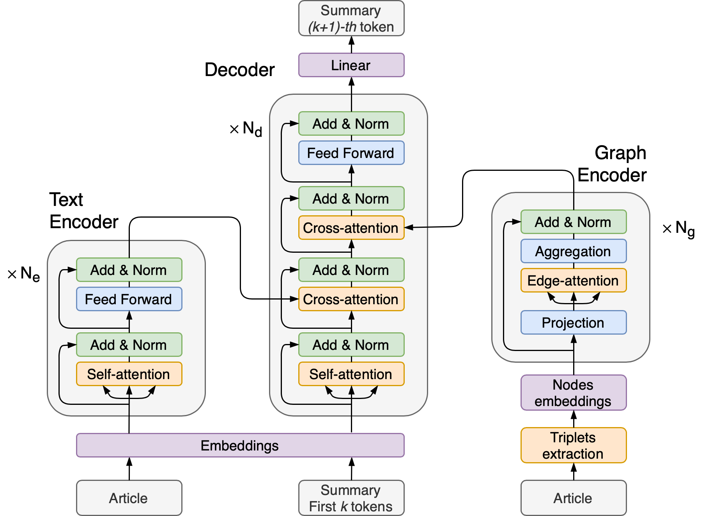
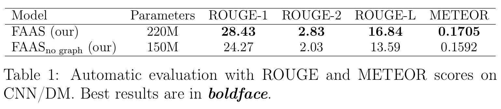
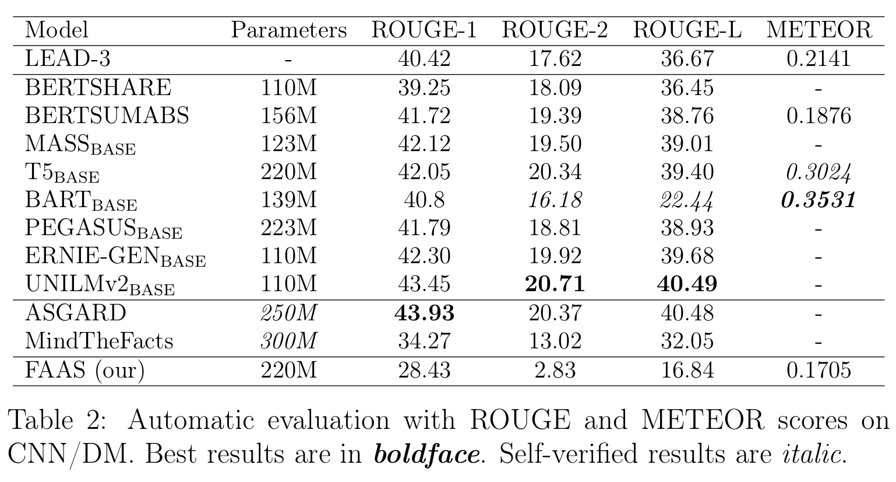

# FAAS - Fact Aware Abstractive Summarization model

This repository refers to a bachelor diploma thesis.  
In this paper, we expand ideas of using source-text knowledge graphs representation along with modern approaches for developing an **abstractive text summarization** model.

 
### Model
In this model, we used a Graph Attention encoder along with a Transformer text encoder to consider facts about entities' relations in addition to general text context.   
 

### Evaluation
The model evaluated on the CNN/Daily Mail dataset shows better results than the model version without a knowledge graph. And it shows poorer, but commensurable results compared to State-Of-The-Art models.

